# 1. DLL 인젝션
실행중인 다른 프로세스에 특정 dll 파일을 강제로 삽입.
즉, 다른 프로세스에게 LoadLibrary API를 호출하여 악성 DLL을 로드하게 만드는것

> 참고: DLL이 프로세스에 로드될때 자동으로 DllMain 함수가 실행된다.

## 방법 3. 메세지 훅 설치: SetWindowsHookEx()
### [리뷰] 실습
Hook : OS 메세지 큐에서 Application 메세지 큐간의 메세지 이동간에 접근하여 메세지를 조작하는 행위
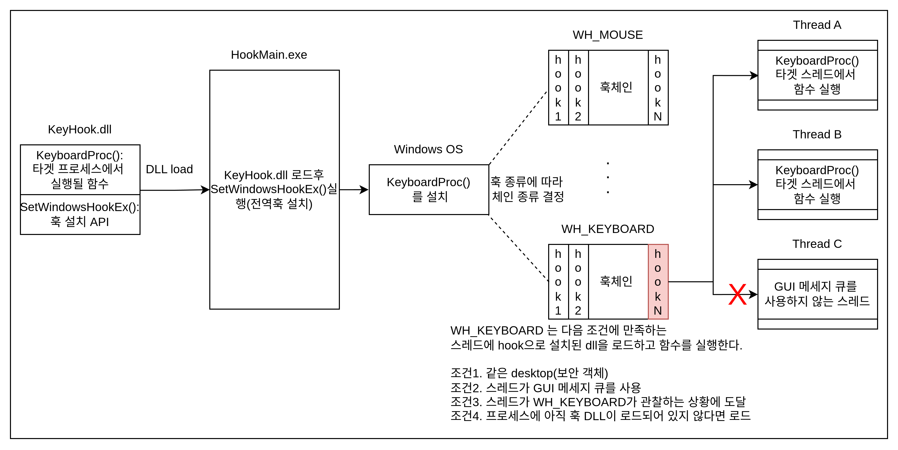

    훅 체인은 훅 종류별로 존재하며, 각각 종류별 조건(예를들어 WH_KEYBOARD 는 스레드가 GUI 메세지 큐를 사용하는 스레드만 적용)에 만족하는 스레드만 타겟으로 기능한다.

1. HookMain.exe 실행
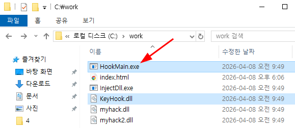
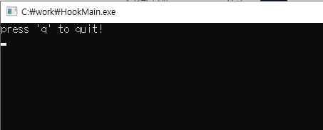

2. notepad.exe 실행후 KeyHook.dll 인젝션 확인
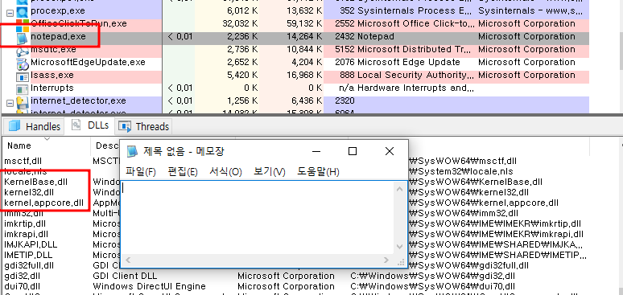
> 인젝션이 되지 않음: 아직 notepad.exe 에 입력 이벤트가 발생하지 않아서 dll이 로드되지 않았다.
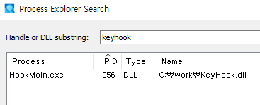

3. notepad.exe 에 키보드 입력
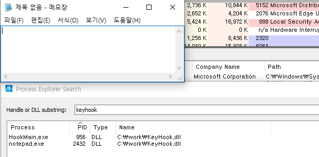
키보드 입력 이벤트가 발생하자, KeyHook.dll 이 로드된것을 확인할수 있다.

4. HookMain.exe 를 종료(키보드 훅 제거)

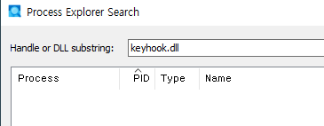

### HookMain.cpp 의 소스코드(cpp)
```cpp
#include "stdio.h"
#include "conio.h"
#include "windows.h"

#define	DEF_DLL_NAME		"KeyHook.dll"
#define	DEF_HOOKSTART		"HookStart"
#define	DEF_HOOKSTOP		"HookStop"

typedef void (*PFN_HOOKSTART)();
typedef void (*PFN_HOOKSTOP)();

void main()
{
	HMODULE			hDll = NULL;
	PFN_HOOKSTART	HookStart = NULL;
	PFN_HOOKSTOP	HookStop = NULL;
	char			ch = 0;

    // KeyHook.dll 로드
	hDll = LoadLibraryA(DEF_DLL_NAME);
    if( hDll == NULL )
    {
        printf("LoadLibrary(%s) failed!!! [%d]", DEF_DLL_NAME, GetLastError());
        return;
    }

    // 현재 프로세스에서 KeyHook.dll의 HookStart,HookStop 함수 주소 획득
	HookStart = (PFN_HOOKSTART)GetProcAddress(hDll, DEF_HOOKSTART);
	HookStop = (PFN_HOOKSTOP)GetProcAddress(hDll, DEF_HOOKSTOP);

    // 후킹 시작 함수 호출
	HookStart();

    // 사용자가 q를 입력할때까지 대기
	printf("press 'q' to quit!\n");
	while( _getch() != 'q' );

    // q 입력시 후킹 중지 함수 호출
	HookStop();
	
    // KeyHook.dll 언로드
	FreeLibrary(hDll);
}
```

### KeyHook.dll 의 소스코드(cpp)
```cpp
#include "stdio.h"
#include "windows.h"

// 타겟 프로세스
#define DEF_PROCESS_NAME		"notepad.exe"

HINSTANCE g_hInstance = NULL;   // dll 핸들
HHOOK g_hHook = NULL;           // 훅의 핸들
HWND g_hWnd = NULL;             

BOOL WINAPI DllMain(HINSTANCE hinstDLL, DWORD dwReason, LPVOID lpvReserved)
{
	switch( dwReason )
	{
        case DLL_PROCESS_ATTACH:
			g_hInstance = hinstDLL;
			break;

        case DLL_PROCESS_DETACH:
			break;	
	}

	return TRUE;
}

LRESULT CALLBACK KeyboardProc(
    int nCode,      // 훅 콜백 함수의 기능을 실행해도 되는지 알려주는 상태코드
    WPARAM wParam,  // 입력한 가상 key 코드 하나
    LPARAM lParam   // 가상 key 코드의 상태정보(31번 비트는 key up(1)/down(0) 을 나타낸다.)
)
{
	char szPath[MAX_PATH] = {0,};
	char *p = NULL;

	if( nCode >= 0 )
	{
		// bit 31 : 0 => press, 1 => release
		if( !(lParam & 0x80000000) ) // lParam == 0 일때 진입
		{
			GetModuleFileNameA(
                NULL,       
                szPath,     // 경로를 저장할 버퍼
                MAX_PATH    // 경로 문자열 크기
            );
			p = strrchr(szPath, '\\');  // 문자열에서 가장 마지막 '\' 의 위치(주소)를 반환, 즉 파일명 직전

            // notepad.exe 이 아닌 
			if( !_stricmp(p + 1, DEF_PROCESS_NAME) ) // 파일의 문자열이 같으면, 다음훅으로 넘어가지 않고 리턴
				return 1;   // return 1 은 이 이벤트를 차단했다는 의미로 os가 해석한다.
		}
	}

    // os가 보기에 KeyboardProc를 실행할 메세지가 아닌경우 다음 훅을 실행한다.
	return CallNextHookEx(g_hHook, nCode, wParam, lParam);
}

// c++컴파일러로 컴파일시, extern "C" {...} 를 통해 블럭 내부의 함수 이름을 유지한다(mangling).
#ifdef __cplusplus
extern "C" {
#endif
    // 이 함수를 DLL 밖으로 export(MSVC/Windows 전용 문법)
	__declspec(dllexport) void HookStart()
	{
		g_hHook = SetWindowsHookEx(
                    WH_KEYBOARD,    // 훅 종류(여기선 키보드 메세지 훅 설정)
                    KeyboardProc,   // 이벤트 발생시 호출할 함수 포인터
                    g_hInstance,    // 콜백 함수가 들어있는 DLL/모듈 핸들
                    0               // 훅을 걸 스레드(여기선 시스템 전역 훅)
                );
	}

	__declspec(dllexport) void HookStop()
	{
		if( g_hHook )
		{
			UnhookWindowsHookEx(g_hHook);
			g_hHook = NULL;
		}
	}
#ifdef __cplusplus
}
#endif
```

### [디버깅 실습] 메세지 훅 설치 SetWindowsHookEx() API

1. HookMain.exe main() 분석
    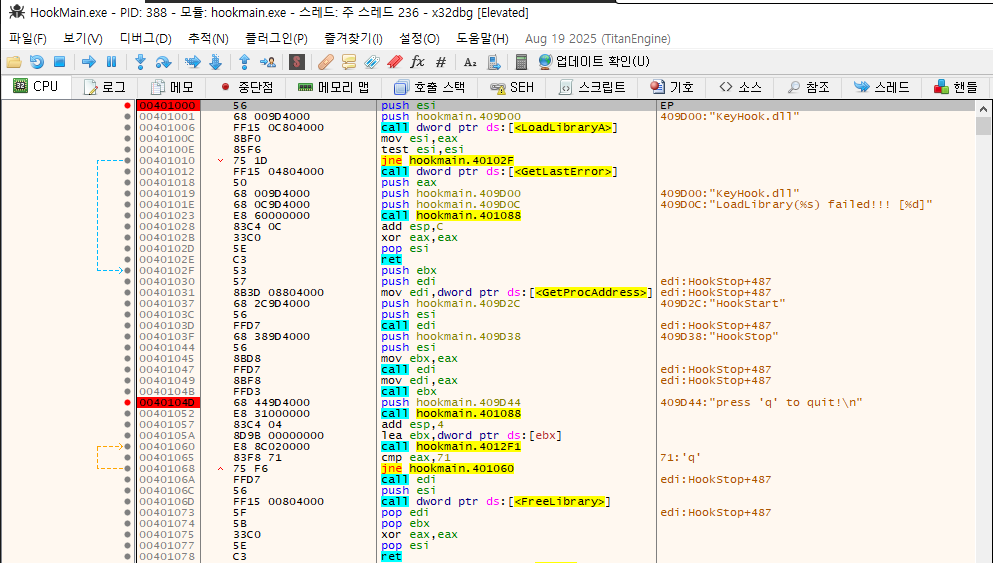
    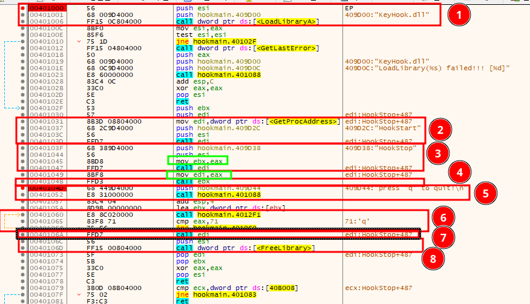
        1. LoadLibraryA(DEF_DLL_NAME);
        2. HookStart = (PFN_HOOKSTART)GetProcAddress(hDll, DEF_HOOKSTART);
        3. HookStop = (PFN_HOOKSTOP)GetProcAddress(hDll, DEF_HOOKSTOP);
        4. HookStart();
        5. printf("press 'q' to quit!\n");
        6. while( _getch() != 'q' );
        7. HookStop();
        8. FreeLibrary(hDll);
    **초록박스**의 명령어를 이용해 HookStart, HookStop 함수주소를 보존한다.

2. HookStart() 안으로 추적, 분석
    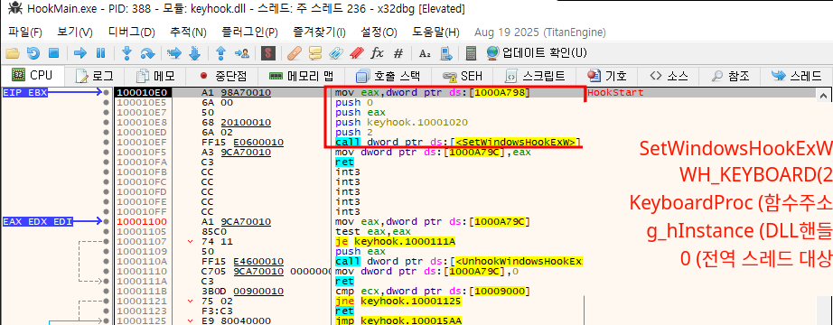
    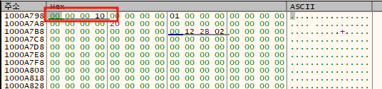
        > 덤프해서 확인한 결과 `SetWindowsHookEx()` 의 세번째 인자 `g_hInstance` 는 [1000A798] == 10000000이다.

3. notepad.exe 분석
    HookMain.exe 를 종료하고 notepad.exe를 x32dbg를 부착하여 실행한다.
    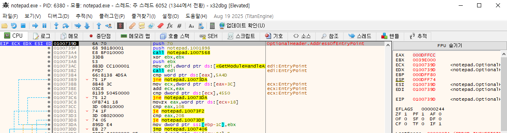
    충분히 notepad.exe를 실행한다.

    그후 사용자 DLL 로드에 체크하고, HookMain.exe를 실행한다.
    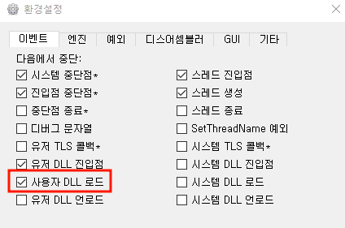
    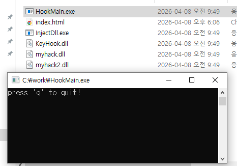

    notepad.exe에 키보드 입력을 시도하면 x32dbg가 로드된 KeyHook.dll에서 멈춰야하는데 왜 안멈추지?
    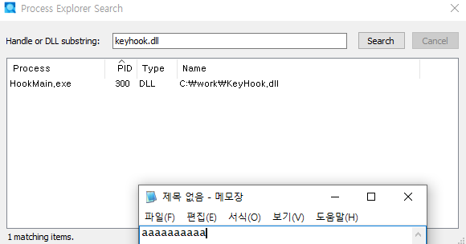

    > 원인 분석결과, `x32dbg [Elevated]`는 관리자 권한으로 실행한 상태를 의미하고, 이로 인해 notepad.exe가 관리자 권한으로 실행되었다. 반면, HookMain.exe는 일반 권한으로 실행한 탓에 `MIC(Mandatory Integrity Control)` 정책에 의해 dll 인젝션이 불가했던것.

    HookMain.exe도 관리자 권한으로 실행한다.
    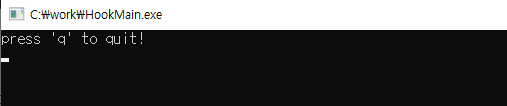
    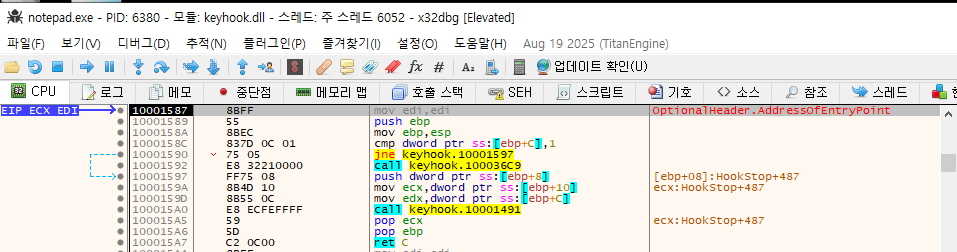

    DLL 로드직후 멈춘 디버거에서 메모리맵을 확인하면 KeyHook.dll 이 로드된것을 확인할수 있다.
    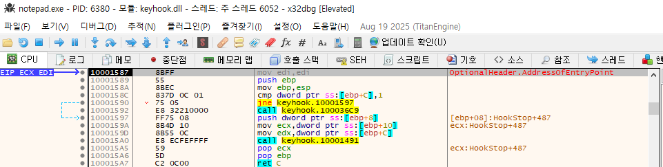
    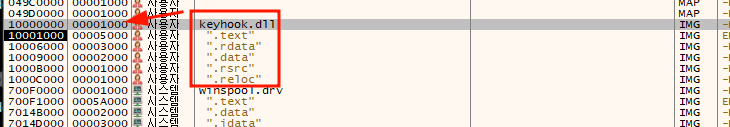


4. KeyHook.dll 분석
    이전 `1. HookMain.exe main() 분석` 에서 찾은 KeyboardProc 프로시저 시작주소(10001020)에 bp를 건다.
    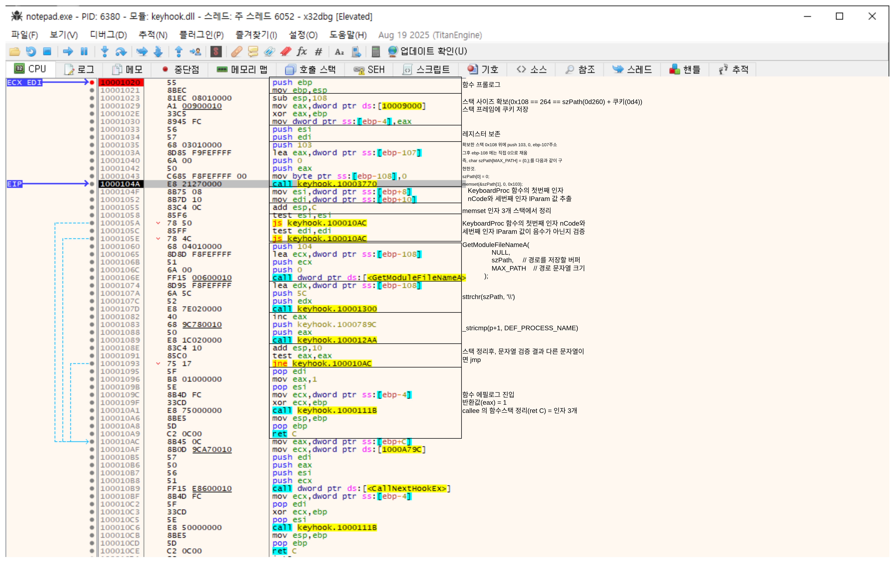


# 관련 자료
[[1] MIC(Mandatory Integrity Control)에 관하여](https://mj-bin.github.io/...)